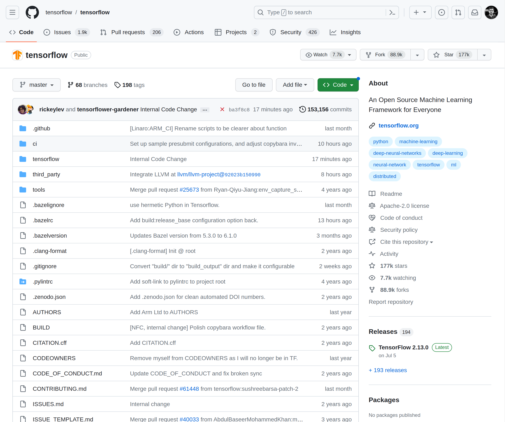
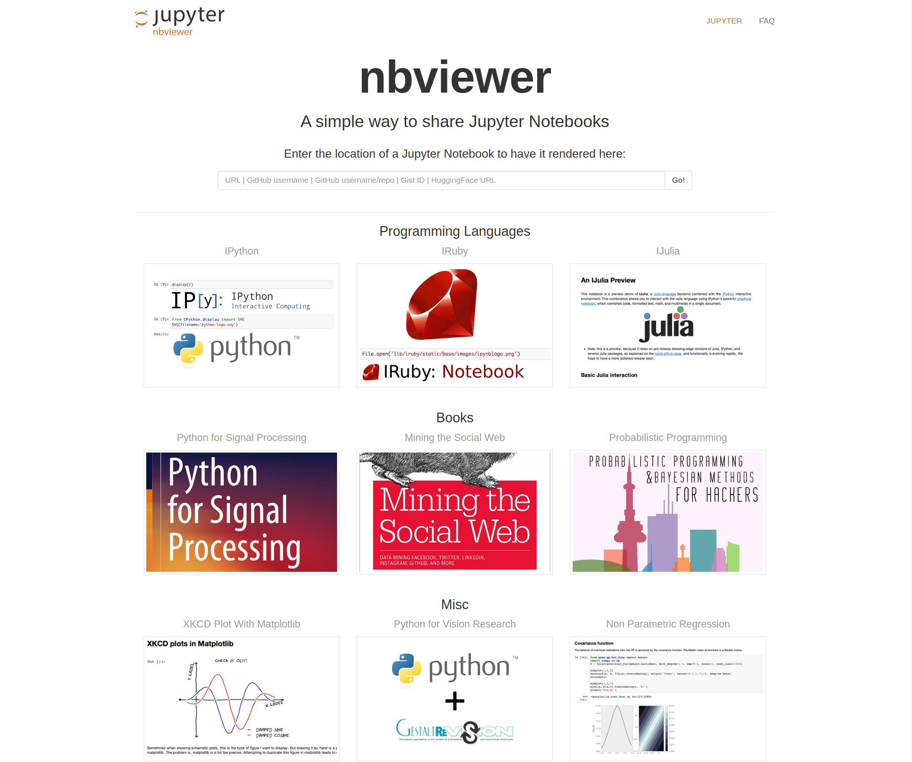
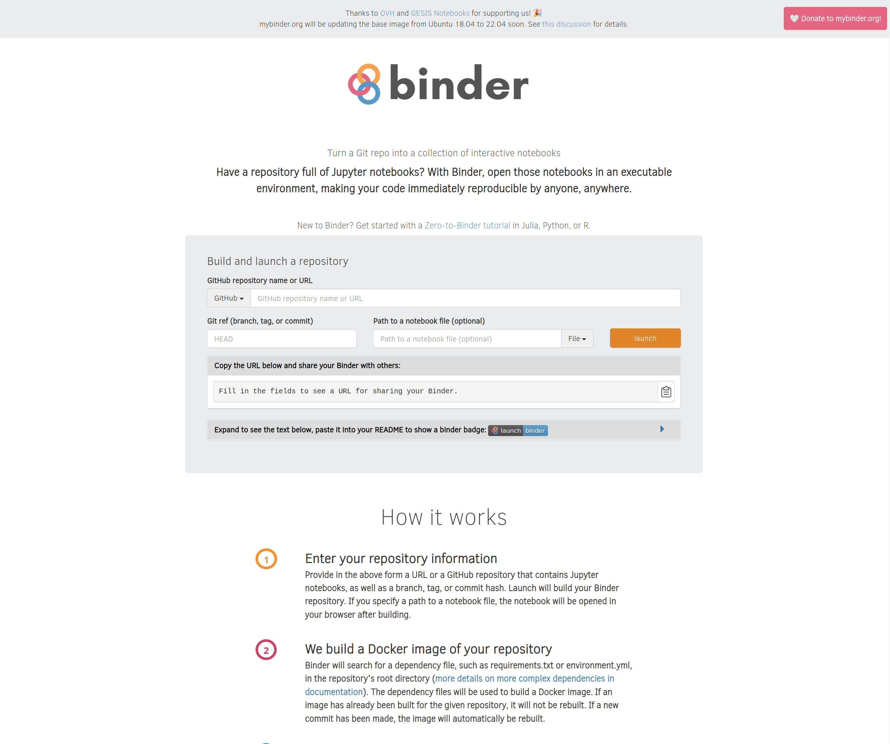
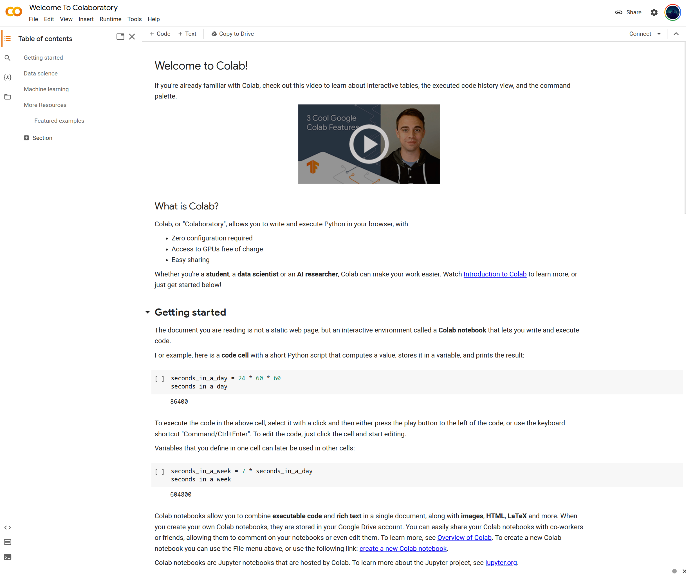
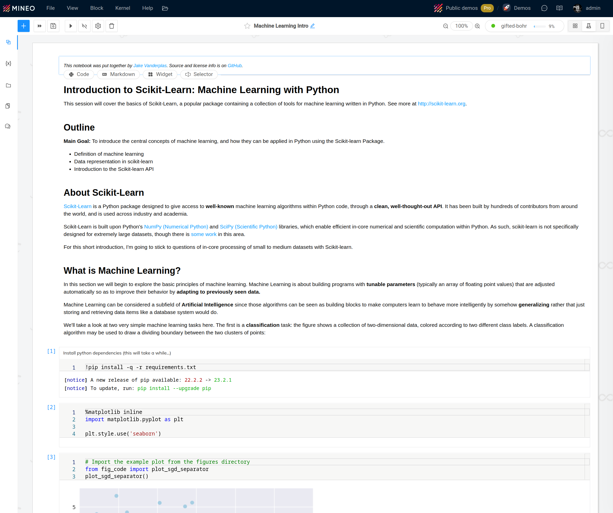

# Tools and Platforms

Imported from `REU - Onboarding and How To's.enex`.

## Auto-Latex Equations - Tutorial

_Created: 2024-02-03; Updated: 2024-02-03_

You can render LaTeX equations in a google doc after installing this extension.

[https://www.autolatex.com/tutorial](https://www.autolatex.com/tutorial)

## BAMM! 2024- abstract submission and travel award application now open

_Created: 2024-01-27; Updated: 2024-01-30_

Dear All,

We hope that you will be able to join us for this year's conference.

BAMM! Biology and Medicine through Mathematics! May 15 - 17, 2024

Abstract submission and the [travel award application](https://forms.gle/sQvPbxHfupvKJtxd7) are now open! Deadline for both is March 1st. Travel awards may be available–grant under review.

[https://siam.vcu.edu/bamm](https://siam.vcu.edu/bamm/)/

This Mathematical Biology conference will be held at Virginia Commonwealth University in Richmond, VA from Wednesday, May 15, to Friday, May 17, 2023. The conference will consist of plenary talks, break-out sessions, and a poster session. We welcome participation from researchers at all academic levels working in mathematical biology. Travel awards may be available–grant under review.

Confirmed plenary speakers:

Janet Best, The Ohio State University

Morgan Craig, University of Montreal and Sainte-Justine University Hospital Research Centre

Abba Gumel, University of Maryland, College Park

See you soon,

Organizing Committee

Associate Dean for Research, College of Humanities and Sciences

Systems Modeling and Analysis PhD Program Director

Department of Mathematics and Applied Mathematics

Virginia Commonwealth University

Professor

Offices: Grace E. Harris Hall 4159 and Blanton House 218

---

To unsubscribe from the BAMM-L list, click the following link:

[http://lists.vcu.edu/scripts/wa-VCUEDU.exe?SUBED1=BAMM-L&A=1](http://lists.vcu.edu/scripts/wa-VCUEDU.exe?SUBED1=BAMM-L&A=1)

## Box account for undergraduate students

_Created: 2024-02-05; Updated: 2024-02-05_

Students are not automatically given Box accounts by the university. Sign up link for a free account

[https://account.box.com/signup/n/personal](https://account.box.com/signup/n/personal)

to begin file sharing with the computational biology lab.

## Coherent PDF Command Line Tools

_Created: 2024-01-29; Updated: 2024-02-01_

[https://community.coherentpdf.com/](https://community.coherentpdf.com/)

[cpdf-binaries-master.zip](attachments/cpdf-binaries-master.zip)

[cpdfmanual.pdf](attachments/cpdfmanual.pdf)

---

## How can I combine multiple PDFs using the command line? - Ask Different

[https://apple.stackexchange.com/questions/230437/how-can-i-combine-multiple-pdfs-using-the-command-line](https://apple.stackexchange.com/questions/230437/how-can-i-combine-multiple-pdfs-using-the-command-line)

## Example  “standalone” figure made using TikZ/PGFplots

_Created: 2024-02-15; Updated: 2024-02-15_

[ai_phase_plane.tex](attachments/ai_phase_plane.tex)

[ai_phase_plane.pdf](attachments/ai_phase_plane.pdf)

## Git Cheat Sheet

_Created: 2023-11-09; Updated: 2024-02-01_

[git-cheat-sheet-education.pdf](attachments/git-cheat-sheet-education.pdf)

## Git Tutorial for Absolute Beginners

_Created: 2023-11-09; Updated: 2024-02-01_

[https://youtu.be/CvUiKWv2-C0?si=KRisy4-p6f6g_HZs](https://youtu.be/CvUiKWv2-C0?si=KRisy4-p6f6g_HZs)

## Gregory V. Bard - Sage for Undergraduates

_Created: 2018-03-19; Updated: 2024-02-05_

[sage_for_undergraduates_color.pdf](attachments/sage_for_undergraduates_color.pdf)

appendicesMap

[appendices.pdf](attachments/appendices.pdf)

## How to Share Jupyter Notebooks: A Step by Step Guide

_Created: 2023-11-28; Updated: 2024-03-02_

[https://www.mineo.app/blog-page/how-to-share-jupyter-notebooks-a-step-by-step-guide#](https://www.mineo.app/blog-page/how-to-share-jupyter-notebooks-a-step-by-step-guide#)

## How to Share Jupyter Notebooks: A Step by Step Guide

### Learn how to share your Jupyter Notebooks effectively using various methods like GitHub, NBViewer, Binder, NBConvert, Google Colab and MINEO. Ideal for data scientists, analysts, and developers.

Learn how to share your Jupyter Notebooks effectively using various methods like GitHub, NBViewer, Binder, NBConvert, Google Colab and MINEO. Ideal for data scientists, analysts, and developers.

### Introduction

[Jupyter notebooks](https://jupyter.org/) have become an indispensable tool for data scientists, analysts, and developers working with Python. They offer an interactive environment to write, run, and share code, visualizations, and markdown text. However, sharing these notebooks can be a challenge, especially when you need to maintain the interactive elements, share with non-technical stakeholders, or collaborate with team members. This blog post aims to solve this problem by exploring various methods to share Jupyter notebooks effectively.

We will delve into four main options: GitHub, Nbviewer, NBConvert, Binder, Google Colab, and MINEO. Each option comes with its own set of features, limitations, and ideal use-cases. We'll provide a detailed introduction, step-by-step guide, and a critical analysis focusing on professional environments for each. So, let's get started.

### GitHub

[GitHub](https://github.com/), the well-known platform for version control and code sharing, has been around since 2008. It supports rendering Jupyter notebooks natively, making it a straightforward option for sharing your work. While it's primarily used for code, GitHub has evolved to become a hub for collaborative projects involving data science and machine learning.

A repository in Github

Steps to Share
1. Push Notebook to Repository: Upload your Jupyter notebook to a GitHub repository.
1. Set Permissions: Make sure the repository is public if you want to share it openly.
1. Share URL: Simply share the URL of the notebook within the repository.

GitHub is excellent for version control and tracking changes, but it**lacks interactive features**. The notebooks are rendered as static HTML pages, so users can't run or modify the code. This makes GitHub less ideal for collaborative data exploration but excellent for code review and versioning.

### Nbviewer

[Nbviewer](https://nbviewer.org/) is a free, open-source service that turns a Jupyter notebook into a static web page. Developed as part of the Jupyter project, it has been a go-to solution for many who want a simple way to share notebooks without any setup.

nbviewer.com

Steps to Share
1. Upload Notebook: Host your notebook on a public URL.
1. Convert: Paste the URL into Nbviewer to generate a static HTML page.
1. Share: Share the generated URL.

Nbviewer is simple and effective for quick sharing because doesn't require user accounts, making it easy to use. However, like GitHub, it **renders notebooks as static web pages**. It's not suitable for real-time collaboration or for sharing with someone who may want to interact with the data. Another important caveat if that your notebook must be accessible from internet as this is not desirable in many cases.

### Binder

[Binder](https://mybinder.org/) is an open-source platform that allows you to turn a GitHub repository into a collection of interactive notebooks. Launched as part of Project Jupyter, it offers a way to share fully interactive Jupyter notebooks without any setup required from the end user.

Steps to Share
1. Repository: Make sure your notebook is in a GitHub repository.
1. Binder Configuration: Add a requirements.txt or environment.yml file to specify dependencies.
1. Launch: Go to Binder and enter your repository URL to create the Binder link.

Binder offers the advantage of sharing fully interactive notebooks with minimal setup. It's excellent for educational purposes and public projects. However, it's not suitable for confidential data, and the computational resources are limited.

### Google Colab

[Google Colab](https://colab.research.google.com/) is a cloud-based service that allows you to write and execute Python code through Jupyter notebooks. Launched in 2017, Google Colab has emerged as a popular platform for data scientists, analysts, and developers who work with Python and Jupyter notebooks. Its cloud-based environment, real-time collaboration features, and free access to GPUs and TPUs make it an attractive option for many.

A simple notebook in Google Colab

Steps to Share
1. Upload to Colab: Import your Jupyter notebook into Google Colab.
1. Set Sharing Permissions: Click on the 'Share' button and set permissions.
1. Share Link: Share the generated link for collaborative editing or viewing.

Google Colab excels in real-time collaboration and resource availability. However, it requires a Google account, which might not be ideal for all professional settings, especially those concerned with data privacy.

### MINEO

[MINEO](https://www.mineo.app/) is a SaaS platform designed to build and deploy data apps based on Python supercharged notebooks. It offers a seamless way to turn your Jupyter notebooks into interactive data applications, designed for professional environments.

A scientific Python Notebook as shown in MINEO

Steps to Share
1. Upload to MINEO: Import or create your Jupyter notebook (.ipynb) into the MINEO.
1. Share the notebook: Open the notebook and press File / Share. You can configure there the options to share the notebook: visibility, access to the code and access to specific individuals, groups or even public access.

MINEO is ideal for creating interactive, shareable data apps. Its focus on data apps makes it highly valuable in professional settings where end-to-end data solutions are needed. However, it some extra features as GPU support are only available in paid plans, which might be a barrier for some teams.

### Converting to Other Formats

Jupyter notebooks can be converted to various formats like PDF, HTML, and slides. This is often done for presentations, documentation, or archiving.

Steps to Share
1. Convert: Use Jupyter's nbconvert utility to convert the notebook.
1. Distribute: Share the converted file through email, cloud storage, or other means.

Converting notebooks is straightforward and excellent for documentation. However, it's not suitable for collaboration as the notebook becomes static and non-interactive.

### Conclusion

Sharing Jupyter notebooks effectively depends on your needs. GitHub and Nbviewer are great for static sharing and version control. Google Colab offers real-time collaboration with computational resources. MINEO stands out for its professional-grade features, turning notebooks into deployable data apps.

Your choice should align with your team's needs, whether it's version control, real-time collaboration, or data application development.

â€

Happy coding!

## Jupyter Notebooks on Sciclone and for W&M students

_Created: 2025-01-09; Updated: 2025-10-31_

[https://notebooks.sciclone.wm.edu/](https://notebooks.sciclone.wm.edu/)

[https://jupyterhub.wm.edu](https://jupyterhub.wm.edu)

## JupyterLab Documentation — JupyterLab 4.0.8 documentation.

_Created: 2023-11-24; Updated: 2026-03-11_

[https://jupyterlab.readthedocs.io/en/stable/](https://jupyterlab.readthedocs.io/en/stable/)

## Latex Equation Toolbox

_Created: 2024-02-02; Updated: 2024-02-02_

[https://viktorstrate.github.io/latex-equation-toolbox/](https://viktorstrate.github.io/latex-equation-toolbox/)

## Learning MATLAB - Self-paced Online Courses

_Created: 2024-02-07; Updated: 2024-02-07_

[https://matlabacademy.mathworks.com/](https://matlabacademy.mathworks.com/)

## Mac OS X - Command-Line Printing and Options

_Created: 2024-01-29; Updated: 2024-02-01_

[https://opensource.apple.com/source/cups/cups-450/cups/doc/help/options.html](https://opensource.apple.com/source/cups/cups-450/cups/doc/help/options.html)

## Sage - Installation Guide

_Created: 2024-02-03; Updated: 2024-03-02_

[https://doc.sagemath.org/html/en/installation/index.html](https://doc.sagemath.org/html/en/installation/index.html)

## The MIT Missing Semester course

_Created: 2024-02-05; Updated: 2024-02-05_

https://missing.csail.mit.edu

## Tikz examples from greg, manuals and link to many online examples that open in writelatex

_Created: 2013-07-11; Updated: 2024-02-05_

[http://www.texample.net/tikz](http://www.texample.net/tikz)/

[tikzpgfmanual.pdf](attachments/tikzpgfmanual.pdf)

[minimaltikz.pdf](attachments/minimaltikz.pdf)

[main.tex](attachments/main.tex)

## William & Mary Jupyter Hub

_Created: 2024-02-06; Updated: 2024-02-06_

[https://jupyterhub.wm.edu/](https://jupyterhub.wm.edu/)

This is one of the easiest ways to get started coding in a Jupyter notebook within Jupyter lab.

Not sure about the sharing/collaboration features yet.

## William & Mary | JupyterHub Online.

_Created: 2024-02-03; Updated: 2025-01-09_

[https://jupyterhub.wm.edu/](https://jupyterhub.wm.edu/)

To install sagemath

conda create -n sage sage python=3.11

---

## Questions about JupyterHub

W&M Research Computing suggested that research workflows may be better served by SciClone/HPC resources than by the classroom-oriented JupyterHub. One common approach is to request compute resources through the batch system and launch a Jupyter notebook manually. Ask Research Computing for current guidance on collaboration features and SageMath kernels.

## Workflowy and Dynalist - Notetaking with collapsible outline feature

_Created: 2024-01-15; Updated: 2024-02-01_

[https://formulae.brew.sh/cask/workflowy#default](https://formulae.brew.sh/cask/workflowy#default)

brew install --cask workflowy

[https://formulae.brew.sh/cask/dynalist#default](https://formulae.brew.sh/cask/dynalist#default)

brew install --cask dynalist

## You have access to Mathematica through William & Mary.

_Created: 2023-02-02; Updated: 2024-02-05_

Mathematica is available through William & Mary. Go to [wolfram.com/siteinfo](https://www.wolfram.com/siteinfo/) and use your William & Mary email address to access the campus license.
